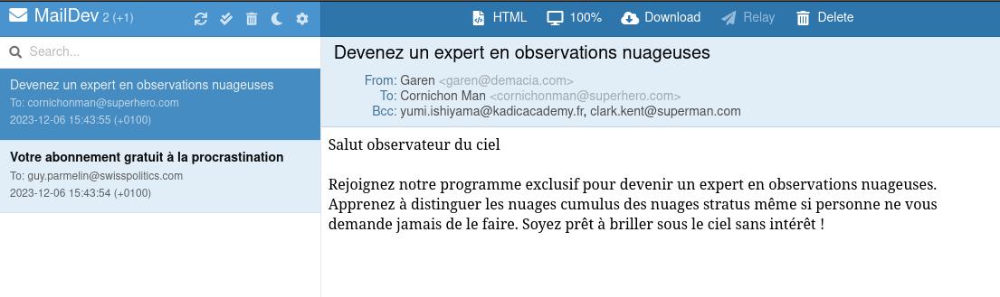

# SMTP Pranking
___
>### Authors
>Arthur Junod & Edwin Häffner
> 
>Based on [DAI lab: SMTP by Ehrensberger Juergen](https://github.com/HEIGVD-Course-DAI/dai-lab-smtp)

## Introduction
A simple SMTP client that can be used to automate sending emails to a list of email addresses.

### Disclaimer
Beware of your local laws, you might get in trouble for this!
You can read this to have more information about the legality
of doing this [Is it legal to prank people with this ?](https://anyleads.com/can-you-get-in-trouble-for-sending-unsolicited-emails)

As this is a school project, we are not responsible for any harm you might cause,
and we will use a mock SMTP server to test our program. *More information below.*

## Description

This project is a simple SMTP client that can be used to automate sending emails
to a list of email addresses. Everything is configurable, from the number of groups
you want to make to the messages you want to send and to which addresses you want to send them.
___
## How does it work and how to use it?

### Class diagram


### The email configuration

The emails are sent in groups, where each group has **one sender**
and the rest are **receivers** or "Victims". Every group is generated from a list of emails
that is configurable in the `configEmail.json` file. It's been set up this way for 
ease of use as JSON is a pretty well-known format, and it's practical to read and write into.

Example of `configEmail.json` :

```json
{
  "VICTIM_LIST": [
    {
      "email": "jean-claude.van-damme@tropcool.com",
      "username": "Jean-Claude Van Damme"
    },
    {
      "email": "nicolas.sarkozy@ohouilafrance.fr",
      "username": "Nicolas Sarkozy"
    }
  ]
}
```

### The message configuration

Every message is stored in the `configMessages.json` file. It's a simple JSON array
where each object is a message. The message has a `subject` and a `body` field. And you
can add as many messages as you want. Know that the messages are picked randomly from
this file list. If you want to send a specific message to a specific group, you can
remove the other messages from the file and only keep the one you want to send.

Example of `configMessages.json` :

```json
{
  "MESSAGE_LIST": [
    {
      "subject": "Découvrez le secret pour une jeunesse éternelle !",
      "body": "Cher destinataire,<br><br>Vous avez été sélectionné pour bénéficier d'une offre exclusive. Des chercheurs réputés ont découvert le secret d'une jeunesse éternelle, et nous voulons le partager avec vous ! Cliquez sur le lien ci-dessous pour révéler l'astuce incroyable qui changera votre vie. Ne manquez pas cette opportunité unique !<br><br>[https://www.youtube.com/watch?v=dQw4w9WgXcQ]"
    },
    {
      "subject": "Votre facture d'électricité explose ? Voici la solution !",
      "body": "Bonjour,<br><br>Nous avons remarqué que votre facture d'électricité a augmenté de manière significative. Ne vous inquiétez pas, nous avons la solution parfaite pour vous ! Notre programme exclusif vous permettra de réduire vos coûts énergétiques de moitié. Cliquez sur le lien ci-dessous pour découvrir comment économiser dès maintenant. Ne laissez pas cette opportunité passer !<br><br>[https://www.youtube.com/watch?v=dQw4w9WgXcQ]"
    }
  ]
}
```

### The number of groups 

The number of groups is easily setup as a command line argument.
You can run the program with a number as an argument.
If you don't specify this argument, **the default value is 5**.

### The SMTP server

As it is probably not legal to actually send bad emails to people without their consent,
it is highly recommended to use a mock SMTP server to test your program. We used [MailDev](https://github.com/maildev/maildev),
which is a mock server that allows you to observe the traffic of the emails that are sent to it.
It also has a WEB interface that allows you to see the emails that are sent to it.

### BCC

The program uses BCC to send one email to multiple people (you can still see it in MailDev).
If you want to send it but with CC instead you can edit by hand the `private final static boolean BCC` 
that is in the *SMTPConstructor* class.

### How to set it up

You can use docker to start the server:

    docker run -d -p 1080:1080 -p 1025:1025 maildev/maildev

This provides a website on localhost:1080 and an SMTP server on localhost:1025.
And unless you tweak this program's code, you will only be able to send emails to the port 1025.
*For obvious reasons.*

Then use :

    mvn package

to compile it with maven and create a .jar file.

You then only have to use the command :

    java -jar target/dai-smtp-1.0.jar <nbr-of-groups>

And that's all you need to run your pranking program.

### Troubleshooting

If `File "configEmail.json" not found` or `File "configMessages.json" not found` is displayed then the terminal
from which you are launching the .jar might be in a folder that doesn't contain these two files.

## Example of running the program

We launch it with:

    java -jar target/dai-smtp-1.0.jar 2

It will result in these SMTP messages (they will be displayed in the terminal):

```shell
Prank program SMTP
220 704b82159354 ESMTP
EHLO https://www.youtube.com/watch?v=dQw4w9WgXcQ

250-704b82159354 Nice to meet you, [172.17.0.1]
250-PIPELINING
250-8BITMIME
250 SMTPUTF8
MAIL FROM: <angelina.jolie@yahoo.com>

250 Accepted
RCPT TO: <guy.parmelin@swisspolitics.com>

250 Accepted
RCPT TO: <odd.della.robbia@kadicacademy.fr>

250 Accepted
DATA
Content-Type: text/html; charset=UTF-8
From: Angelina Jolie <angelina.jolie@yahoo.com>
To: Guy Parmelin <guy.parmelin@swisspolitics.com>
Subject: Votre abonnement gratuit à la procrastination

Cher maître de la procrastination<br><br>Nous avons le plaisir de vous informer que vous avez été automatiquement inscrit à notre programme d'abonnement gratuit à la procrastination. Pour annuler veuillez ignorer ce message et reporter cette tâche à plus tard. Vous pouvez aussi ne rien faire c'est tout aussi bien.
.

354 End data with <CR><LF>.<CR><LF>
250 Message queued as mumWLDZX
QUIT

220 704b82159354 ESMTP
EHLO https://www.youtube.com/watch?v=dQw4w9WgXcQ

250-704b82159354 Nice to meet you, [172.17.0.1]
250-PIPELINING
250-8BITMIME
250 SMTPUTF8
MAIL FROM: <garen@demacia.com>

250 Accepted
RCPT TO: <cornichonman@superhero.com>

250 Accepted
RCPT TO: <yumi.ishiyama@kadicacademy.fr>

250 Accepted
RCPT TO: <clark.kent@superman.com>

250 Accepted
DATA
Content-Type: text/html; charset=UTF-8
From: Garen <garen@demacia.com>
To: Cornichon Man <cornichonman@superhero.com>
Subject: Devenez un expert en observations nuageuses

Salut observateur du ciel<br><br>Rejoignez notre programme exclusif pour devenir un expert en observations nuageuses. Apprenez à distinguer les nuages cumulus des nuages stratus même si personne ne vous demande jamais de le faire. Soyez prêt à briller sous le ciel sans intérêt !
.

354 End data with <CR><LF>.<CR><LF>
250 Message queued as CzjmoSQZ
QUIT

Client: end
```
Then, if you go to http://localhost:1080, you should be able to access your MailDev docker and see something like this: 


